# Roles d'hote

Tous les ordinateurs connectés à un reseau et qui participent directement au communications transmises sur le reseau sont des hotes. Les hotes sont aussi appeles des peripheriques finaux. Plus precisement une hote est une machine qui a une adresse ip attribué pour communiquer

## Peer-to-Peer

Quand un ordi fait office de serveur et de client sur le serveur on dit que le reseau est peer-to-peer

<figure><figcaption></figcaption></figure>

## Peripheriques intermediaires

Les peripheriques intermediaires connectent les peripheriques finaux sur le reseau

## Supports Reseau

Les reseaux modernes utilisent principalement 3 supports pour la connexion des peripheriques:

* Fils metalliques dans les cables: les donnes sont encodes en impulsions electriques
* Verre ou fibres plastiques (fibre optique): les donnes sont encodes en pulsations lumineuses
* Transmission sans fil : les donnes sont codes par modulations de frequence specifique d'ondes électromagnétiques

<figure><figcaption></figcaption></figure>

## Representations du reseau

<figure><figcaption></figcaption></figure>

En plus des icones il y a aussi des termes precis comme :

* NIC (Carte d'interface reseau) = Une NIC relie physiquement le dispositif terminal au reseau
* Port physique = Un port ou une prise sur un dispositif reseau qui ou le support se connecte a un autre dispositif terminal ou reseau
* Interface = Port specialise sur un dispositif reseau qui se connecte a des reseaux individuels. Exemple les ports sur le routeurs qui se connectent aux reseaux sont des interfaces de reseau


Port et Interface sont souvent utilises l'un pour l'autre


## Diagramme de topologie

Diagramme de topologie physique: dans le schemas on voit l'emplacement des peripheriques

Diagramme de topologie logique: on voit a quoi les peripheriques sont connectes, quel interface, etc...


fournisseur de service (PS) fournisseur de services Internet (ISP)



L'Internet n'est la propriete de personne, pour cela plusieurs organisations se sont mis en place pour garder un ordre, comme Internet Engineering Task Force (IETF), Internet Corporation for Assigned Names and Numbers (ICANN), Internet Architecture Board (IAB) entre autres.


## Intranets et Extranets

Intranet est utilises pour parler d'une connexion prives de LAN et de WAN qui appartient a une organisation. Seuls les membres qui ont eu acces peuvent y aller

Une entreprise peut utiliser un extranet pour donnet acces sur et securise pour les personnes qui ont besoin des donnes et travaillent pour une autre organisation&#x20;

<figure><figcaption></figcaption></figure>

## Internet

<mark style="color:$danger;">**C'est un reseau des reseaux, c'est l'ensemble de reseaux interconnectes**</mark>


ADSL (Asymmetric Digital Subscriber Line)

DSL (Digital Subscriber Line)


## Connexions Internet des petits bureaux et des bureaux a domicile

<figure><figcaption></figcaption></figure>

Un utilisateur a domicile va preferer le DSL et le cable, alors qu'un teletravailleur sera avec une connexion cellulaire. Pour finir les petits bureaux vont se connecter avec un satellite ou une ligne commutee

* **Câble** - Généralement proposé par les fournisseurs de services de télévision par câble, le signal de données Internet est transmis sur le même câble que celui qui achemine la télévision par câble. Il offre une large bande passante, une grande disponibilité et une connexion permanente à l'internet.
* **DSL** -Les lignes d'abonné numériques DSL offrent également une large bande passante, une grande disponibilité et une connexion permanente à l'internet. La technologie DSL utilise une ligne téléphonique. En général, un utilisateur de bureau à domicile ou de petit bureau se connecte à l'aide d'une ligne ADSL (Asymmetric Digital Subscriber Line), sur laquelle la vitesse descendante est supérieure à la vitesse ascendante.
* **Cellulaire** - L'accès à Internet par téléphone cellulaire utilise un réseau de téléphonie mobile pour se connecter. Partout où vous captez un signal cellulaire, vous pouvez accéder à Internet. Les performances sont limitées par les capacités du téléphone et de la tour de téléphonie cellulaire à laquelle il est connecté.
* **Satellite** - La disponibilité de l'accès à l'internet par satellite est un avantage dans les régions qui, autrement, n'auraient aucune connectivité internet. Les antennes paraboliques nécessitent une ligne de vue claire vers le satellite.
* **Ligne commutée** - Une option peu coûteuse qui utilise n'importe quelle ligne téléphonique et un modem. La faible bande passante des connexions par ligne commutée n'est généralement pas suffisante pour les transferts de données importants, mais cette solution reste utile pour accéder à Internet lors d'un déplacement.

## Connexion Internet d'entreprises

<figure><figcaption></figcaption></figure>

* **Ligne louée dédiée** - Les lignes louées sont des circuits réservés au sein du réseau du fournisseur de services qui relient des bureaux géographiquement séparés pour un réseau privé de voix et/ou de données. Les circuits sont généralement loués sur une base mensuelle ou annuelle.
* **Metro Ethernet** - Ceci est parfois connu sous le nom Ethernet WAN. Dans ce module, nous l'appellerons Metro Ethernet. Les Metro ethernets étendent la technologie d'accès au LAN au WAN. Ethernet est une technologie LAN que vous découvrirez dans un autre module.
* **Business DSL** - Business DSL est disponible dans différents formats. Un choix populaire est la ligne d'abonné numérique symétrique (SDSL) qui est similaire à la version grand public de la DSL mais qui permet les téléchargements en amont et en aval aux mêmes vitesses élevées.
* **Satellite** - Le service par satellite peut fournir une connexion lorsqu'une solution câblée n'est pas disponible.

## Architecture du reseau

Pour garantir que un reseau fonctionne bien il y a 4 criteres:

* Tolerence aux pannes
* Evolutivite
* Quality of Service (QoS)
* Securite

## Tolerence aux pannes

Les reseaux tolerents aux pannes sont les reseaux qui limitent le nombre de dispositifs affectes lors d'une pane, et aussi a quelle vitesse on peut les remettre en place. Ces reseaux s'appuient sur le fait qu'il y'a pas qu'un seul peripherique reseau qui fait passer le message, si ce peripherique tombe un pane le message est envoye vers un autre lien. Le fait de disposer de plusieurs choix s'appelle la <mark style="color:$danger;">**redondance**</mark>

La mise en place d'un reseau a commutation de paquets est un des moyens avec lequel les reseaux fiables assurent la redondance. Un mail ou une video est coupe en plusieurs paquets que le reseau va commuter en fonction de l'etat du reseau. Les paquets peuvent prendre plusieurs chemins differents pour arriver a la meme destiantion.&#x20;

## Evolutivite

Un reseau evolutif se base sur le fait qu'on peut facilement ajouter un nouvel appareil au reseau sans **perturber** les anciens users. En outre, les reseaux sont evolutifs etant donne que les concepteurs font appel a des normes et a des protocoles reconnus.

## Quality of Service (QoS)

On peut parler de QoS quand on voit une video saccadee, les appels VOIP ont des problemes, etc... Les communications voix et video convergent sur le meme reseau, la QoS constitue consiste a faire en sorte que tout soit fluide pour l'user

Un encombrement survient lorsqu'une demande excessive de bande passante depasse les capacites disponibles. La bande passante reseau est mesure en fonction de nombre de bits passant par seconde (bit/s). Lorsque plusieurs communications sont initees en meme temps cela peut depasser la bande passante creant un encombrement du reseau.

Lorsque le volume du trafic est superieur a ce qui peut etre transmis les appareils gardent les paquets en memoire jusqu'a ce que des ressources soit disponibles pour les transmettre

<figure><figcaption></figcaption></figure>

## Securite du reseau

L'infrastructure reseau, les services et les donnees stockees sur les peripheriques sont des actifs personnelles et professionnels essentiels. Les admin sys doivent s'ocuper de la securite du reseau et de la securite des informations

La securisation de l'infrastructure comprend la securisation physique des peripheriques et de la prevention de l'acces non autorise aux logiciels de gestion qui y resident

<figure><image src="./image.png"><figcaption></figcaption></figure>

Les admins sys doivent egalement proteger les informations dans les paquets transmis sur le reseau ainsi que les informations stockees sur les peripheriques connectes au reseau, pour cela on a 3 criteres:
    Confidentialite - seuls les destinataires prevus et autorises peuvent acceder aux donnes et les lire
    Integrite - les donnes n'ont pas ete modifie avant l'arrive
    Disponibilite - acces rapide et fluide aux services de donnees pour les users autorises

# BYOD (Bring Your Own Device)

BYOD donne aux user finaux la liberte d'utiliser leurs propres appareil pour se acceder aux informations et communiquer a travers un reseau d'entreprise ou de campus. Le BYOD c'est pour tout type d'appareil

# Collaboration en ligne

Les users souhaitent se connecter au reseau pour avoir acces aux donnees mais aussi pour collaborer 

# Communication video

La video est essentielle a l'effort de communication et de collaboration. Toute personne disposant d'une connexion internet peut faire un appel video, quel que soit l'endroit

# Cloud Computing 

Un des moyens de acceder aux donnees et de les stocker. Le cloud computing nous permet de stocker des fichiers personnels, et meme un disque entier sur des serveurs via l'internet. Des applications comme le traitement de texte et l'edition de photos sont sur le cloud

Pour les entreprise le cloud offre de nouvelles fonctionnalites sans devoir investir dans l'infrastructure, changer le staff, ni acheter des licenses.

Le cloud computing fonctionne grace aux centres de donnes qui hebergent les systemes informatiques et les composants associes. Souvant les grandes entreprises ont leur propre data center pour les user alors que les petites entreprises se le permettent pas, du coup en louant des services de serveur cela peut baisser le cout total de possession (TCO)

Pour des raisons de securite, tolerences aux pannes et fiabilites les donnees sont stockes dans des data center distribues.

Il existe 4 types de cloud differents:
    Les cloud publics
    Les cloud prives
    Les cloud hybrides
    Les cloud communautaires

Voici un tableau avec les 4 d'expliques:

<figure><figcaption></figcaption></figure>

# Tendances technologiques domestiques

Les tendances technologiques affectent aussi notre vie au quotidien comme les aspects de la maison, on appelle ca les "technologies domestiques intelligentes"

Cette technologie s'integre dans les appareils menagers quotidiens qui peuvent ensuite se connecter a d'autres appareils pour les rendre "intelligent" ou automatises. Ex: un four qui fait chauffer la nourriture a l'heure indique sur notre calendrier et qui nous envoie un message par la suite

<figure><figcaption></figcaption></figure>

# Haut debit sans fil

Dans les zones ou le cable ou le DSL ne passent pas on peut se connecter en sans fil pour etablir une connexion

Un fournisseur de services internet sans fil (WISP) est un fournisseur qui connecte les abonnes a un point d'access ou un point d'acces en utilisant des technologies sans fil similaires a celles que l'on trouve dans des reseaux locaux sans fil (WlAN)

Pour le haut debit sans fil on installe une antennte a l'exterieur de la maison ou de la petite entreprise, dans de nombreseus regions cela commence a concurrencer la tech DSL et le cable

# Menaces de securite 

La sécurisation d'un réseau implique des protocoles, des technologies, des dispositifs, des outils et des techniques afin de protéger les données et d'atténuer les menaces. Ces risques ou menaces peuvent être externes ou internes. De nos jours, de nombreuses menaces externes pour la sécurité des réseaux proviennent de l'internet.

Il existe plusieurs menaces externes courantes pour les réseaux :

    • Virus, vers, et chevaux de Trois - logiciels malveillants et code arbitraire s'exécutant sur un périphérique utilisateur.
    • Spyware et adware - Ce sont des types de logiciels qui sont installés sur l'appareil d'un utilisateur. Le logiciel recueille alors secrètement des informations sur l'utilisateur.
    • Attaques du jour zéro - Appelées aussi attaques de l'heure zéro, elles se produisent le premier jour où une vulnérabilité est connue.
    • Attaques des acteurs de menace - Une personne malveillante attaque les appareils des utilisateurs ou les ressources du réseau.
    • Attaques par déni de service - Ces attaques ralentissent ou bloquent les applications et les processus sur un périphérique réseau.
    • Interception et vol de données - Cette attaque permet de capturer des informations privées sur le réseau d'une organisation.
    • Usurpation d'identité - Cette attaque consiste à voler les identifiants de connexion d'un utilisateur afin d'accéder à des données privées.

Faut aussi faire gaffe des menaces internes car la pluspart du temps les employes savent pas utiliser un peripherique, perte ou vol d'un peripherique, etc..

# Solutions de securite

La securite se fait sur plusieurs couches. Pour la mise en place de la securite sur un reseau domestique c'est plutot simple, on l'implemente sur les appareils terminaux ainsi qu'au point d'acces a l'internet 

Les elements de base de la securite d'un reseau domestique ou d'un petit bureau:
    Antivirus et antispyware
    Filtrage par pare-feu

Alors que pour la securite d'une entreprise est constitue de nombreux composants integres dans le reseau, on a un antivirus, antispyware et un filtrage par pare-feu en meme temps en plus des composants ajoutes
    **Systemes de pare-feu dedies** : ils offrent de firewall plus avancees 
    Liste de controle d'acces (ACL) : filtrage par IP
    **Systeme de prevention des intrusion (IPS)** : Ils identifient les menaces qui se repandent vite comme les attaques zero day
    **Reseaux prives virtuel (VPN)** : Ils offrent une connexion a distance securise

# Acces a Cisco IOS

# Methode d'acces

Un commutatuer transmet le traffic par defaut et n'a pas forcement besoin d'etre configure, c'est pour cela que 2 pc configures connectes au meme nouveau commutateur vont pouvoir communiquer

Tous les commutatuers doivent etre configures et securises.

<figure><figcaption></figcaption></figure>

# Programmes d'emulation de terminal 

    PuTTY
    Tera Term
    SecureCRT

# Verification de la syntaxe des commandes IOS

<figure><figcaption></figcaption></figure>

Si une commande est complexe on peut la voir explique comme ceci:

<figure><figcaption></figcaption></figure>

# Raccourcis IOS

<figure><figcaption></figcaption></figure>

<figure><figcaption></figcaption></figure>

# Modes de commandes principaux

<figure>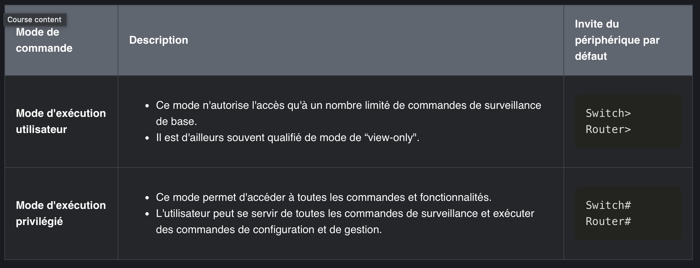<figcaption></figcaption></figure>

Il y a aussi **configure terminal**

# Noms des peripheriques

Il faut donner un nom logique aux peripheriques, pour cela on a des directives:
    Commence par une lettre
    Pas d'espace
    Se termine par une lettre ou un chiffre
    Ne comporte que des lettres,chiffres ou tirets
    Comporte moins de 64 caracteres

Pour donner un nom on doit etre en **conf t** 
La commande est **hostname { nom }**

# Configurer les mots de passe

On doit securiser la connexion d'execution utilisateur et Telnet avec un mdp

On a aussi des regles pour les mdp :
    + de 8 caracteres
    Une combinaison de lettres, chiffres, minuscules, majuscules, caracteres speciaux, etc...
    Ne pas utiliser le meme mdp sur tous les peripheriques intermediaires
    Ne pas utiliser des mots simples a deviner

On doit aller en **conf t** pour securiser le mode d'execution utilisateur, puis dans la configuration de la console de ligne avec la commande **line console 0**. Le 0 sert a representer la premiere (et souvent la seule) interface de console. Ensuite on fait **password {password}** afin d'activer l'acces d'execution utilisateur a l'aide la commande login.

Pour securiser le mode privilegie on sera toujours en conf t et on uitilisera la commande **enable secret {password}**. Ici il y a pas besoin de faire login

Les lignes VTY (virtual terminal) activent l'acces a distance Telnet ou SSH. Souvent c'est de 0 a 15

Cette fois ci on utilise la commande **vty 0 15**. Puis comme le mode d'execution utilisateur on utilisera password puis login.

# Chiffrer les mots de passe

Les fichiers startup-config et running-config affichent la pluspart des mdp en clair.
Pour les chiffrer on sera en **conf t** et on utilise **service password-encryption**

C'est un chiffrement simple pour tous les mdp pas chiffres.

On peut utiliser la commande **show running-config** pour verifier

# Message de banniere

Le message de banniere sert a dire qu'un peripherique est utilisable que par certaines personnes, c'est tres important de faire ce message.

Pour creer une banniere MOTD (Message Of The Day) on doit etre en **conf t** et utiliser la commande **banner motd #{message}#**. Le # sert a delimiter le message

# Fichiers de config

Deux fichiers systemes stockent la config des peripheriques:
    startup-config : C'est le fichier stocke dans le NVRAM (memoire vive non volative). Ca contient toutes les commandes qui seront utilises au demarrage ou au redemarrage. La NVRAM ne perd pas son contenu lors de la mise hors tension du peripherique.
    running-config : C'est stocke dans la memoire vive (RAM). Il reflete la config actuelle. La RAM perd tout son contenu lorsque le peripherique est mis hors tension ou redemarre.

Pour enregistrer les modifications apportes a la config en cours dans le fichier de config initiale, la commande **copy running-config startup-config** sera utilise.

# Modifier la config en cours

Si les modifications n'ont pas l'effet souhaite et que la config n'est pas enregistree, on peut restaurer le peripherique avec la commande **reload**. En utilisant reload le peripherique est hors ligne.

Des fois on doit supprimer le startup-config si c'est deja enregistree on peut utiliser la commande **erase startup-config**


IPv6 utilise DHCPv6 et SLAAC (configuration automatique d'adresses sans etat) pour l'allocation dynamique d'adresses.


# Configuration de l'interface de commutateur virtuelle

Pour accéder à distance au commutateur, une adresse IP et un masque de sous-réseau doivent être configurés sur l'interface **SVI**. Pour configurer une SVI sur un commutateur, utilisez la commande de configuration globale interface vlan 1 . Vlan 1 n'est pas une interface physique réelle mais une **interface virtuelle**. Attribuez ensuite une adresse IPv4 à l'aide de la commande de configuration d'interface ip address ip-address subnet-mask. Enfin, activez l'interface virtuelle à l'aide de la commande de configuration d'interface no shutdown .

Une fois ces commandes configurées, le commutateur dispose de tous les éléments IPv4 adaptés pour la communication sur le réseau.


Utilisez la commande **show ip interface brief** pour afficher l'adresse IP et l'état de tous les ports et les interfaces des commutateurs


**La structure d'une adresse IPv4 est appelee "notation decimale a point" et est composee de quatre nombres decimaux compris entre 0 et 255**

# Notions sur les bases de communications

Trois elements en commun peu importe la methode :
    Source du message (expediteur)
    Destination du message (destinataire)
    Canal - Il s'agit du support qui assure le cheminement du message de sa source a la destination

# Definition des regles


Les regles sont les protocoles


Les protocoles doivent respecter certaines regles pour bien trasmettre un message: 
    L'identification du destinataire de et l'expediteur
    L'utilisation d'une langue et d'une syntaxe communes 
    La vitesse et le rythme d'elocution
    La demande de confirmation ou d'accuse de reception

# Exigences Relatives au Protocole de Réseau

Les protocoles utilisés dans le cadre des communications réseau partagent bon nombre de ces caractéristiques fondamentales. En plus d'identifier la source et la destination, les protocoles informatiques et réseau définissent la manière dont un message est transmis sur un réseau.
Les protocoles informatiques communs comprennent les exigences suivantes :

    • Codage des messages
    • Format et encapsulation des messages
    • La taille du message
    • Synchronisation des messages
    • Options de remise des messages

# Codage des messages

Pour envoyer un message il faut d'abord le coder. Le codage est la conversion des infos vers un autre format acceptable, a des fins de transmission. Le decodage inverse le processus pour lire l'information

# Format et encapsulation des messages

Le message envoye doit suivre une structure ou un format specifique. Les formats dependent du canal utilise pour transmettre le message 

<figure>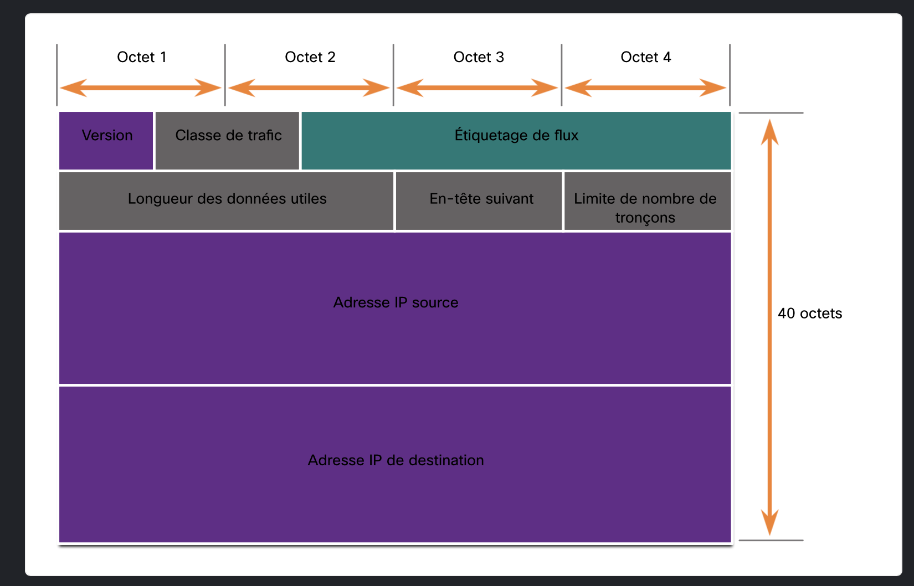<figcaption></figcaption></figure>

Tout comme l'envoi d'une lettre, un message qui est envoyé sur un réseau informatique suit des règles de format spécifiques pour sa livraison et son traitement.

Internet Protocol (IP) est un protocole avec une fonction similaire à l'exemple d'enveloppe. Dans la figure, les champs du paquet IPv6 (Internet Protocol version 6) identifient la source du paquet et sa destination. IP est responsable de l'envoi d'un message de la source du message vers la destination sur un ou plusieurs réseaux.

# Taille des messages

Les trames trop longues ou trop courtes ne sont pas transmises.
Un message long est envoye en plusieurs trames contenant chacune un fragement du message. Chaque trame possede aussi ses informations d'adressage. Au niveau de l'hote destinataire, les differents morceaux du message sont reconstruits de maniere a recomposer le message d'origine

# Synchronisation des messages

Controle de flux - processus de gestion de la vitesse de transmission des donnees. Le controle de flux definit la quantite d'informations qui peuvent etre envoyes et a quelle vitesse

Delai de reponse - C'est comme une personne qui pose une question et n'a pas de reponse du coup ell reagit en consequence. La question peut etre repete, ou passer a autre chose, etc..

La methode d'acces - C'est comme 2 personnes qui parlent en meme temps et ne se comprennent pas, lorsque un peripherique veut transmettre un message sur un reseau sans fil la carte d'interface reseau WLAN (NIC) doit determiner si le support sans fil est dispo

# Modes de transmission de message

Monodiffusion - A une seule personne
Multidiffusion - A plusieurs personnes choisi
Diffusion - A tout le monde

**A REVOIR 3.2 LES PROTOCOLES**

# Suites de protocoles

<figure>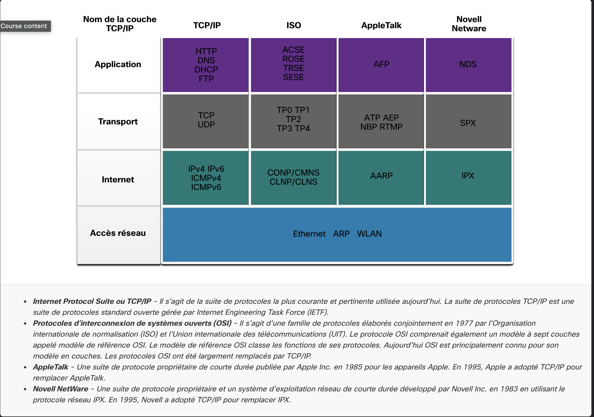<figcaption></figcaption></figure>

# Exemples de protocole TCP/IP

Les protocoles TCP/IP sont dispo pour les couches application, transport et internet. Il y en a pas pour la couche d'acces reseau. Les protocoles LAN de couche d'acces reseau les plus courants son Ethernet et WLAN (LAN sans fil). Les protocoles de la couche d'acces reseau sont responsable de la remise du paquet IP sur le support physique

<figure>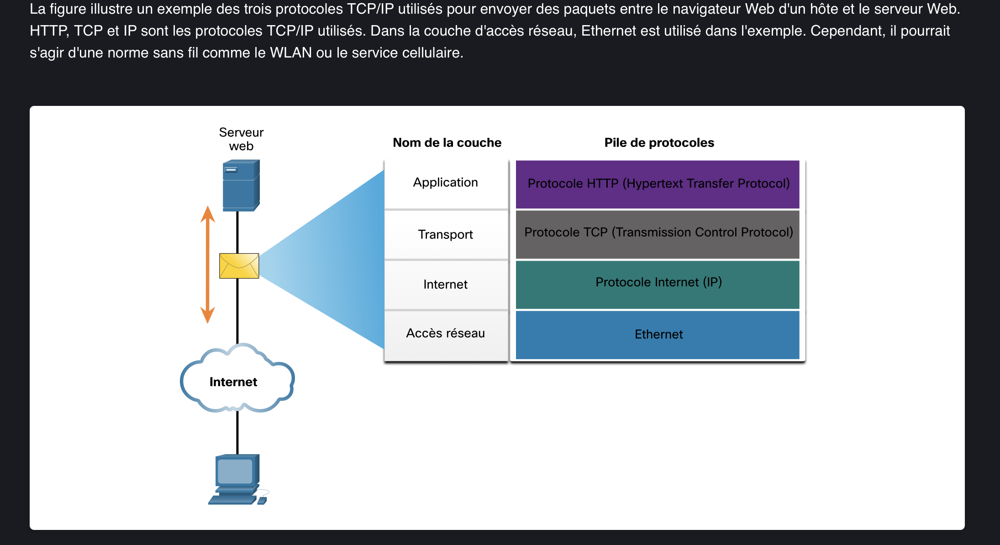<figcaption></figcaption></figure>

<figure>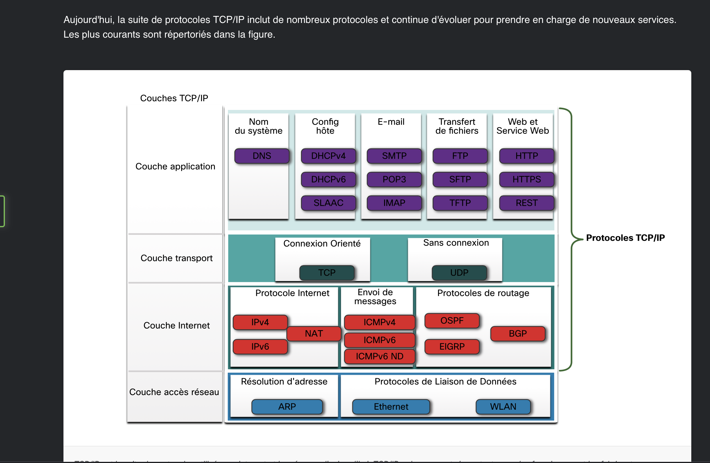<figcaption></figcaption></figure>

**Couche d'application**

Nom du systeme
    DNS - Systeme de noms de domaine, traduits les noms de domaine comme google.com en adresse ip

Config. hote
    SLAAC - Methode qui permet au peripherique d'avoir son adresse IPv6 sans utiliser un serveur DHCPv6
    SMTP - Protocol de Transfert de Courrier Simple 
    POP3 - Protocole de la Poste v3
    IMAP - Protocole d'Acces aux Messages Internet. 

E-mail
    SMTP - Simple Mail Transfer Protocol
    POP3 - Protocole de la Poste v3
    IMAP - Internet Message Access Protocol

Transfer de fichiers
    FTP
    SFTP
    TFPT - Protocol de Transfer de Fichiers Trivial

Web et Service Web
    HTTP
    HTTPS
    REST

**Couche Transport**

Connexion Oriente
    TCP

Sans connexion
    UDP

**Couche Internet**

Le Protocol Internet
    IPv4
    IPv6
    NAT - Netword Adress Translation

Envoie de Message
    ICMPv4 - Protocole de message de contrôle Internet pour IPv4. Fournit un retour d'information d'un hôte de destination à un hôte source sur les erreurs de livraison de paquets.
    • ICMPv6 - ICMP pour IPv6. Fonctionnalité similaire à ICMPv4, mais elle est utilisée pour les paquets IPv6.
    • ICMPv6 ND - Détection de voisin ICMPv6. Inclut quatre messages de protocole utilisés pour la résolution d'adresses et la détection d'adresses en double.

Protocoles de Routage
    • OSPF - Ouvrez d'abord le chemin le plus court. Protocole de routage d'état de liaison qui utilise une conception hiérarchique basée sur des zones. Il s'agit d'un protocole de routage interne standard ouvert.
     EIGRP - Protocole de routage amélioré des passerelles intérieures. Protocole de routage propriétaire de Cisco qui utilise une métrique composite basée sur la largeur de bande, le délai, la charge et la fiabilité.
    • BGP - Protocole de passerelle frontalière. Un protocole de routage de passerelle extérieure standard ouvert utilisé entre les fournisseurs de services Internet (ISPs). Le protocole BGP est également utilisé entre les ISPs et leurs clients privés plus importants pour échanger des informations de routage.

**Couche acces reseau**

Resolution d'adresse
    ARP - Protocole des Resolution des Adresses. Fournit un mappage d'adresse dynamique entre une adresse IPv4 et une adresse physique.

Protocoles de Liaisons de donnees
    Ethernet - Definit les regles relatives aux normes de cablages et de signalisation de la couche d'acces au reseau
    WLAN - Reseau local sans fil. Definit les regles de signalisation sans fil sur les frequences radio 2,4 GHz et 5 GHz

<figure>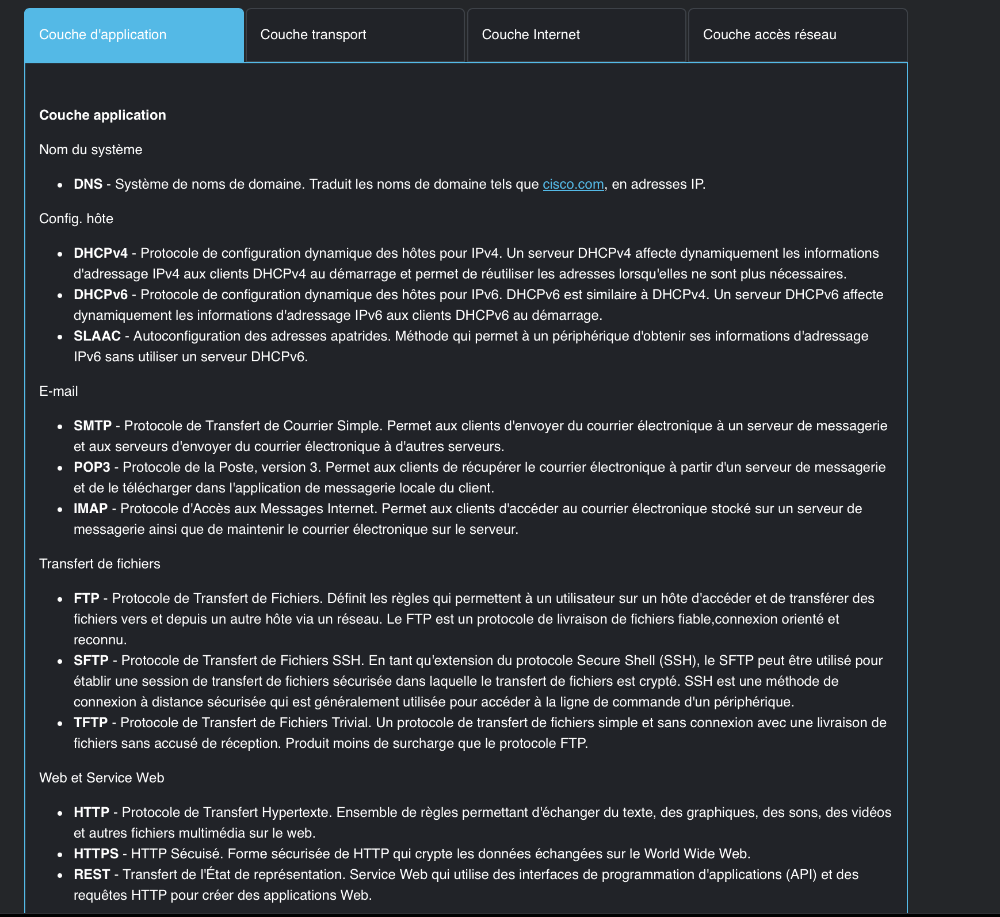<figcaption></figcaption></figure>

<figure>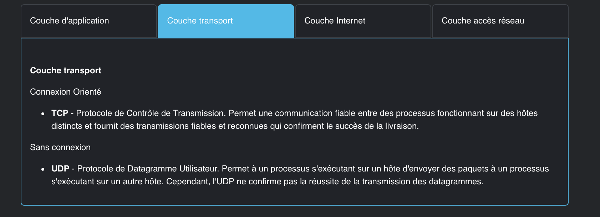<figcaption></figcaption></figure>

<figure>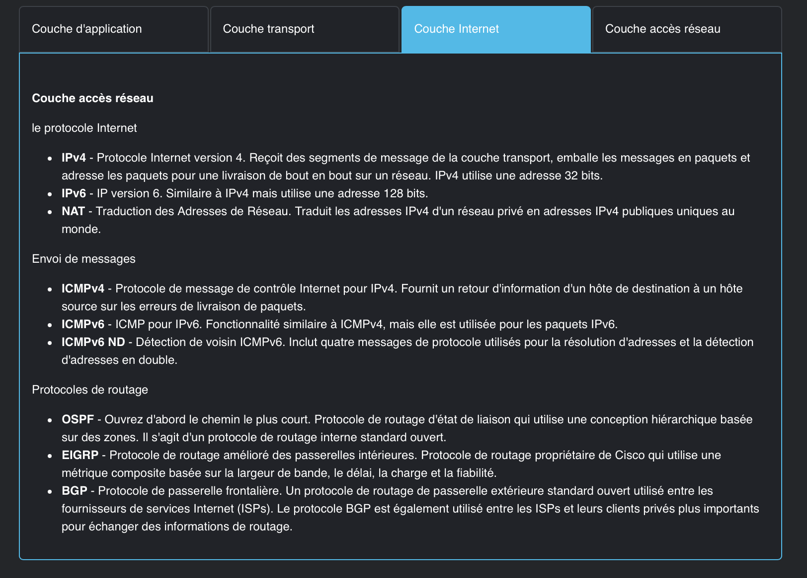<figcaption></figcaption></figure>

<figure>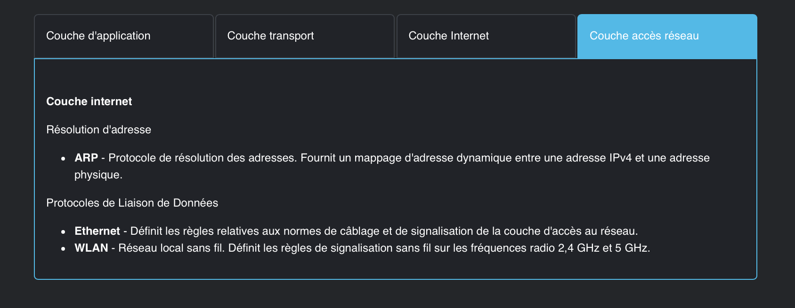<figcaption></figcaption></figure>

# Processus de communication TCP/IP

<figure>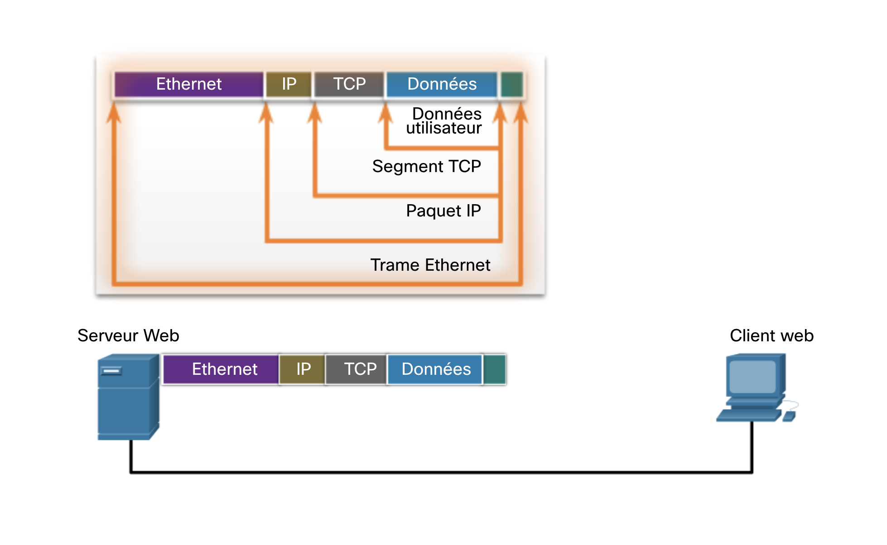<figcaption></figcaption></figure>

Pour decapsuler le client va dans l'ordre inverse, d'abord Ethernet, IP, TCP et pour finir Donnees

# Normes ouvertes

Ce sont les regles que tout le monde doit appliquer pour avoir un internet ouvert. Quand on achete un routeur sans fil ils ont tous les protocoles IPv4, IPv6, DHCP, SLAAC, Ethernet et 802.11 Wireless

L'image montre le logo de chaque organisme de normalisation

<figure>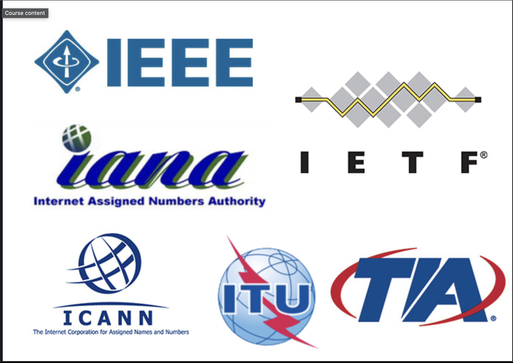<figcaption></figcaption></figure>

# Normes Internet

<figure>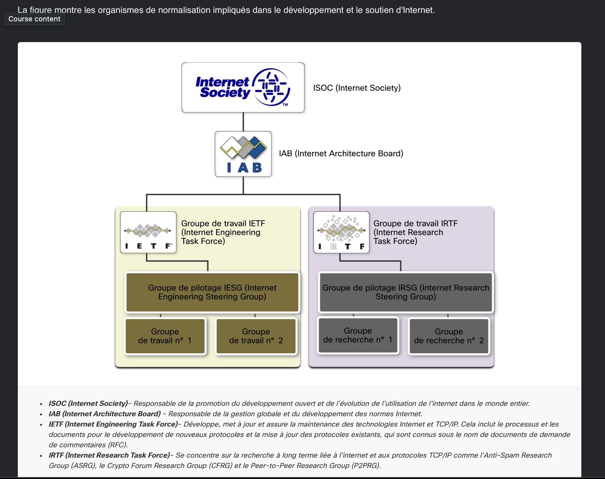<figcaption></figcaption></figure>

<figure>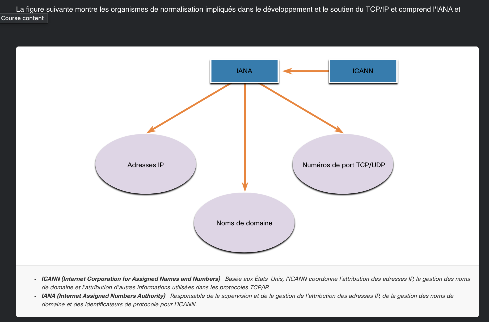<figcaption></figcaption></figure>

<figure>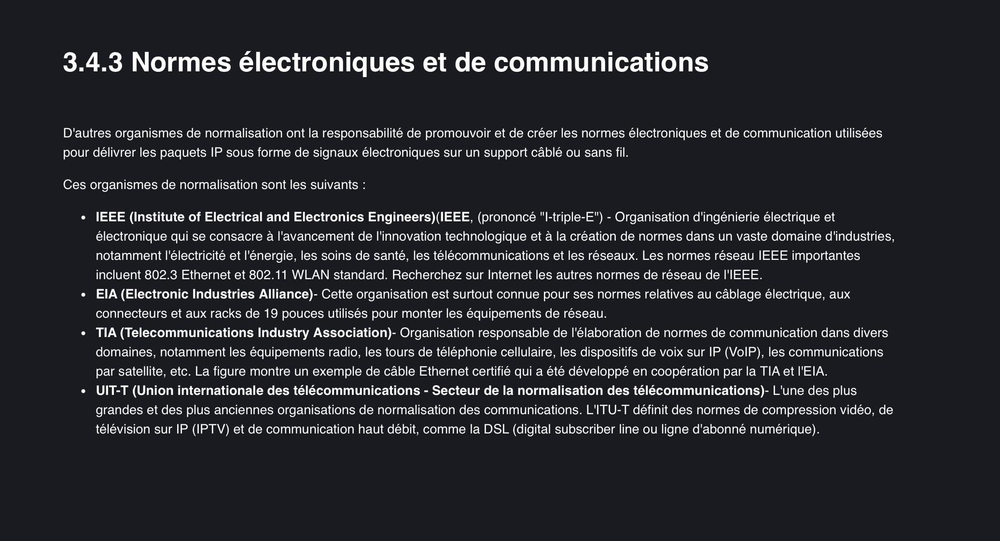<figcaption></figcaption></figure>

**REVOIR LES ORGANISMES DE NORMALISATION**

# Les modeles en couches

<figure>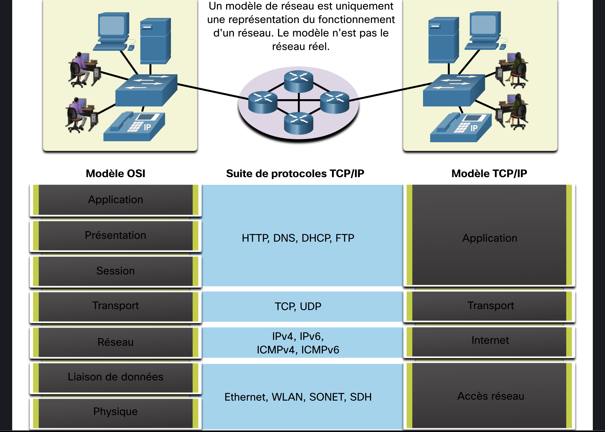<figcaption></figcaption></figure>

# Modele OSI

<figure>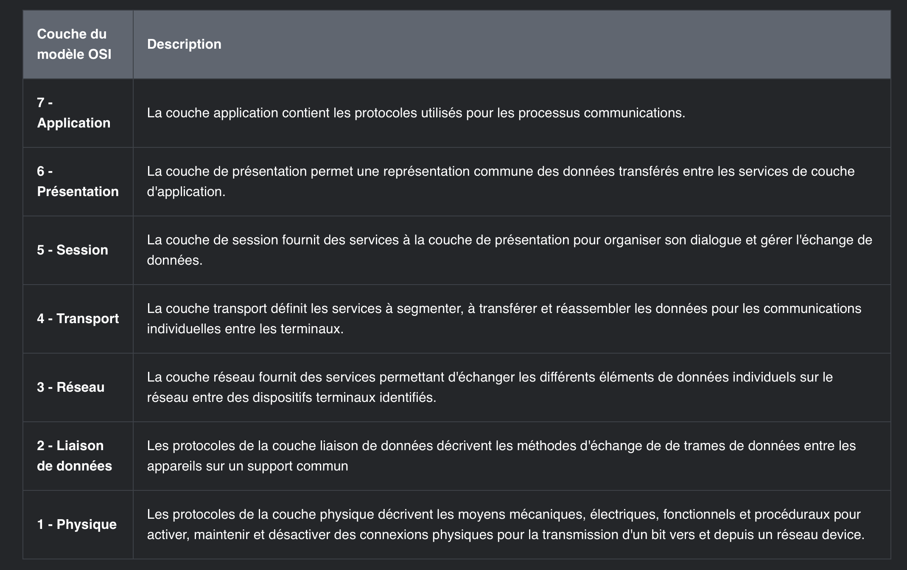<figcaption></figcaption></figure>

# Modele TCP/IP

Il est utilise comme modele de reference. Il explique aussi les fonctions qui interviennent a chaque couche de protocoles.

<figure>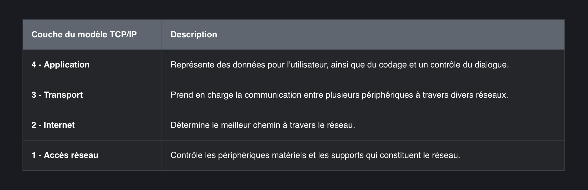<figcaption></figcaption></figure>

# Les differences

<figure>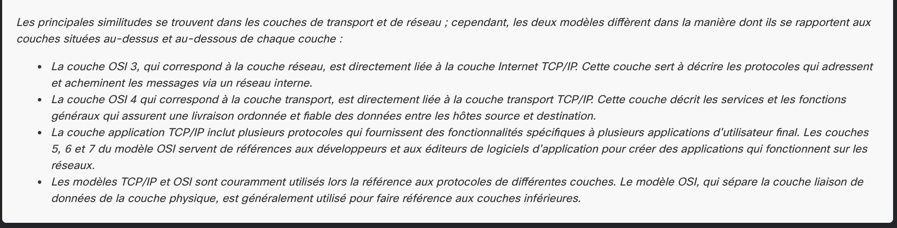<figcaption></figcaption></figure>

